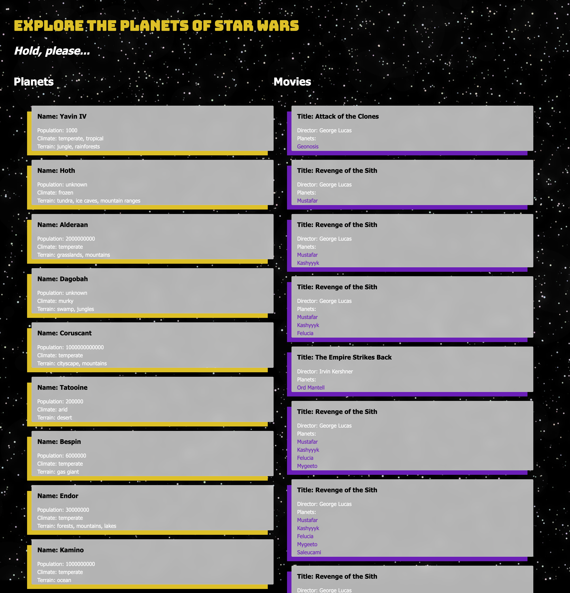

# Starwars API
Built by Bianca. 

# Project Description

This project fetches and displays data from a Starwars API. You will see a list of Starwars planets and the films they appear in. On the second web page, there is more information displayed on each movie. Simple! Built to practice using ayschronous Jacascript and APIs.

# Live link
You can view the deployed project here: https://starwarsplanetsinfo.netlify.app/planets.html

## Screenshots

# Download

To launch the project on your local computer, download the files from this github repository.

Open 'films.html' or 'planets.html' to view either page in your browser. 

# Built With
- HTML
- CSS
- Javascript
- Starwars API: https://www.swapi.tech/